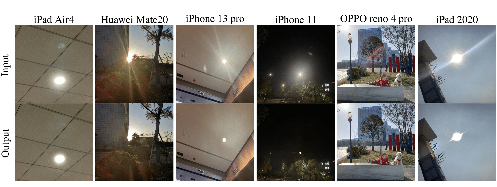

# ICCV 2023: Improving Lens Flare Removal with General Purpose Pipeline and Multiple Light Sources Recovery
[Paper](https://arxiv.org/abs/2308.16460)

[Yuyan Zhou](https://github.com/YuyanZhou1), [Dong Liang](http://faculty.nuaa.edu.cn/liangdong/zh_CN/index.htm), [Songcan Chen](http://parnec.nuaa.edu.cn/), [Sheng-Jun Huang](http://parnec.nuaa.edu.cn/huangsj), [Shuo Yang](https://scholar.google.com/citations?user=mbIW-KMAAAAJ&hl=zh-CN), [Chongyi Li](https://li-chongyi.github.io/)

MIIT Key Laboratory of Pattern Analysis and Machine Intelligence, College of Computer Science and Technology,

Nanjing University of Aeronautics and Astronautics, Nanjing, China

Imaging Technology Group, DJI Innovations Co. Ltd., Shanghai, China

School of Computer Science, Nankai University, Tianjin, China


## Dataset
### Training data
Wu el al. training images are provided in [How to Train Neural Networks for Flare Removal](https://github.com/google-research/google-research/tree/master/flare_removal) (Wu et al. ICCV 2021)

Flare7K training images are provided in [Flare7K: A Phenomenological Nighttime Flare Removal Dataset](https://github.com/ykdai/Flare7K) (Dai et al. NeurIPS 2022). 

Please follow their instructions to access the data.
### Test data
The consumer electronics dataset can be downloaded in [Google Cloud](https://drive.google.com/drive/folders/1J1fw1BggOP-L1zxF7NV0pYhvuZQsmiWY?usp=sharing).

or [Baidu Netdisk](https://pan.baidu.com/s/1KPjDAvNDaLwdxBgtRGPe2A 
password：ptb3)
### Pre-trained Model
The inference code based on Uformer can be downloaded in [Google Cloud](https://drive.google.com/drive/folders/1ngjUh6UzA99-XLi6esK9OdP7ORhU6i8R?usp=sharing).

## Code
The backbone of our code is from Wu et al. [How to Train Neural Networks for Flare Removal](https://github.com/google-research/google-research/tree/master/flare_removal). We imporve the synthesis pipeline and light source recovery method to obtain better performance on flare removal. 
### Train
```
python train.py	  --flarec_dir=path/to/captured/flare   --flares_dir=path/to/simulated/flare    --scene_dir=path/to/scene/image
```
### Test
```
python  remove_flare.py   --input_dir=path/to/test/image/dir   --out_dir=path/to/output/dir --model=Uformer    --batch_size=2    --ckpt=path/to/pretrained/model
```
